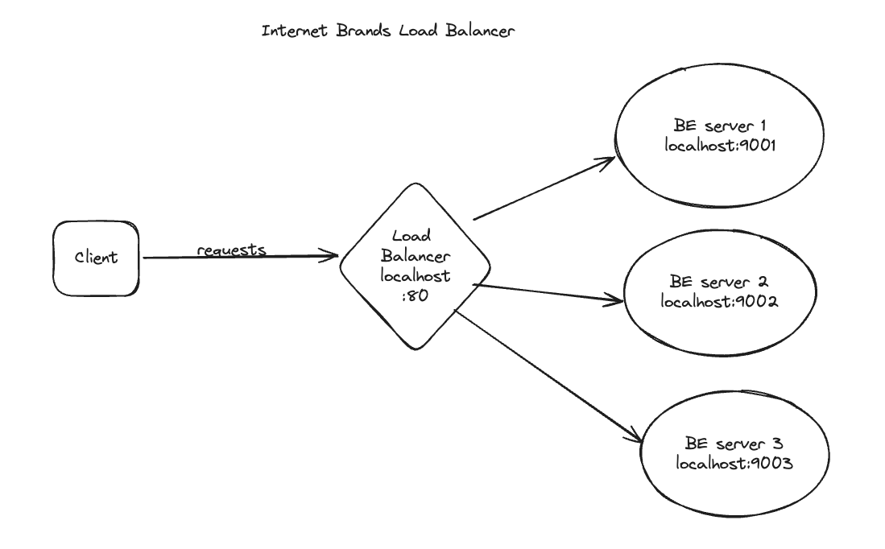
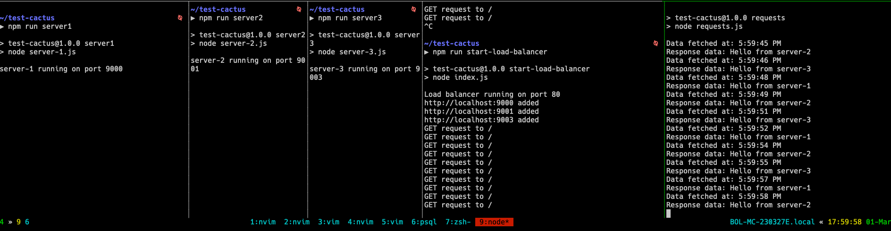
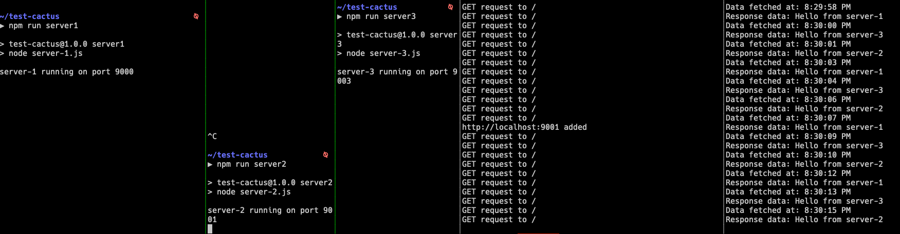

## Load balancer POC
### Features of a load balancer
- Accept HTTPS requests and terminate SSL
- Load balance across multiple backend application servers
- Health check endpoints on each server for monitoring status
- Weighted round robin algorithm to distribute loads based on server capacity
- Session affinity/stickiness — route requests from same client to same backend
- Graceful handling of servers being added or removed
- Customizable with different balancing strategies
- Detailed logging and metrics for monitoring


### MVP
For illustrative purposes only this project implements at basic level the next features:

- Load balance across multiple backend application servers
- Health check endpoints on each server for monitoring status
- Round robin algorithm to distribute loads based on server capacity
- Graceful handling of servers being added or removed




## Installation
### Requeriments
- Nodejs and npm installed

Locate the project and install the dependencies
```
npm install
```

### Spinning up the nodes

Launch individual backend servers in separate terminals for efficient monitoring and independent control

```bash
npm run server1
```

```bash
npm run server2
```

```bash
npm run server3
```
Launch Load balancer in a separate terminal

```
npm run start-load-balancer
```

Finally; lauch the script which calls the load balancer every 1.5 secs

```
npm run requests
```

You should have something like this:



Play arround stopping one of the backend servers and spin the same up again!!!

